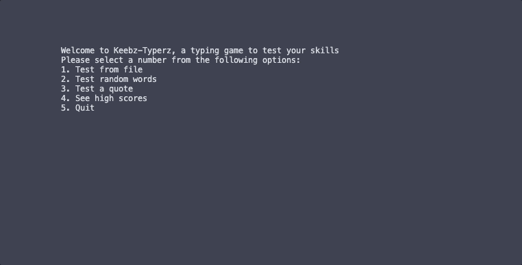

# CLI Typing test

## Source repository

[Github repo](https://github.com/mjkgarrow/typing-speed-terminal-app)


## Purpose

<p align="center">
    
</p>

This Python CLI program tests the user's typing speed with prompts from the user, random words online or famous quotes. After the game finishes you can save your score to a scores.txt file, which is ordered with the reigning champion at the top.

---


## Usage

sadfkaskdjfhaks


---

## Install

If using MacOS, Ubuntu or Linux:

1. Quick virtual environment setup, install requirements and run game:
```
./quick_setup.sh
```

2. Just virtual environment setup and installing requirements:
```
./install_requirements.sh
```

3. Run game if virtual environment and requirements already installed
```
./run_app.sh
```

If using Windows, try installing Cygwin and following these instructions: [Cygwin  FAQ](https://www.cygwin.com/faq.html#faq.setup.setup)

---

## Packages

This program uses the following Python packages:

- curses
- time
- os
- textwrap
- requests
- random
- numpy

---

## Features

### Choose from 3 types of games:
- Load a typing prompt from file
- Test your typing with random words
- Test your typing with a famous quote

### Load input from a file
- You can provide a path to a .txt file you would like to practice typing on. The typing prompt is limited to 50 words

### Review previous scores, with the current leader at the top
The app will search for a previous scores text file.

### Save your score to a file
When you save your score it will be automatically ordered into the previous scores, ordered by wpm/difficulty/accuracy

### Display live typing results
Statistics include:
- ***Instant text response***  
User typed characters will appear either green = correct, or red = incorrect
- ***Time remaining***  
User gets 30 seconds. This makes the game fun, 60 seconds was too long and was tiring to play.

- ***Words-per-minute (wpm)***  
Calculated with the formula below. The industry standard is for 5 characters to equal a 'word':
```
wpm = (total-typed-characters / 5) / 60 seconds
```
- ***Accuracy***  
The percentage of correct characters.

- ***Consistency***  
The coefficient of variation of the wpm scaled 0 - 100% (higher is better). The formula was inspired by [Monkey Type](https://monkeytype.com/about):
```
wpm_list = [list of all wpm result from each time the user presses a key]
wpm_mean = the average of the wpm_list
wpm_standard_deviation = the standard deviation of the wpm_list
wpm_coefficient = 100 - ((wpm_standard_deviation / wpm_mean) * 100) 
```

### Choose difficulty

User can select between 'Easy mode', which is just regular play, or 'Hard mode', which disables the delete/backspace key.

Choosing hard mode also means you will be promoted higher in the final scores.

--- 

## Code Styling

This codebases follows the Python [PEP 8 styleguide](https://peps.python.org/pep-0008/).

This includes 


## References