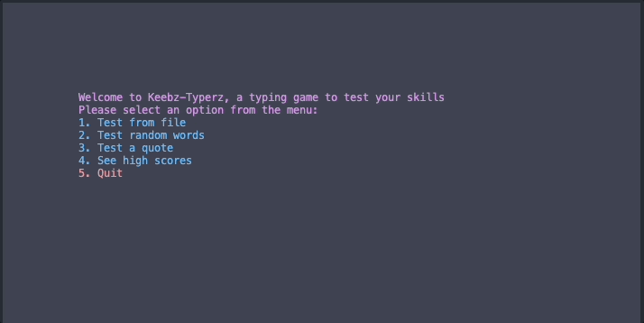
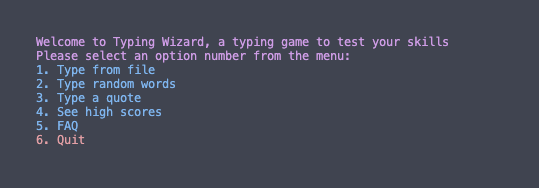
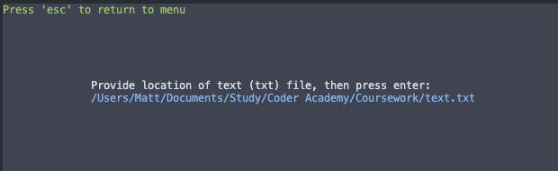
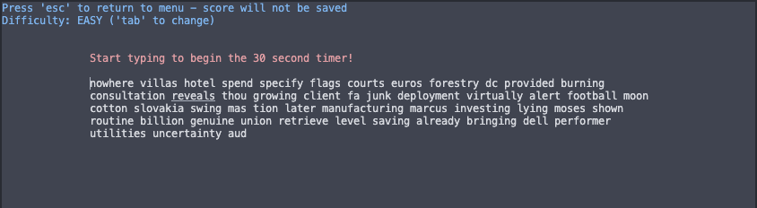
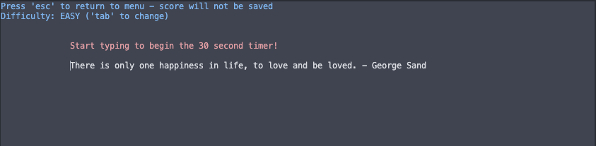
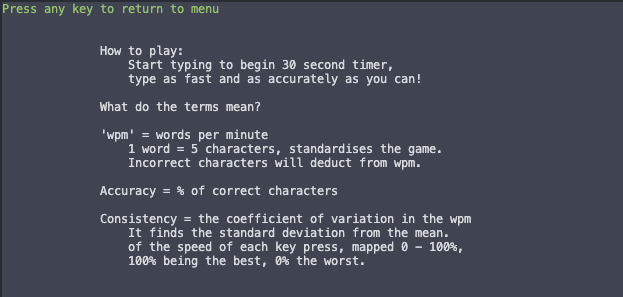
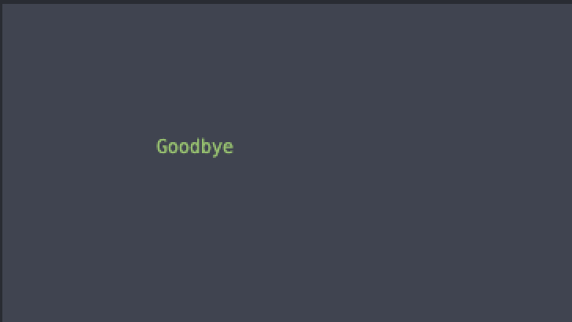
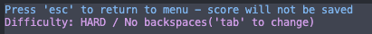
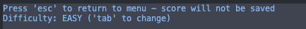
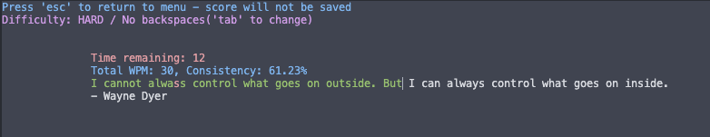

# CLI Typing test

## Purpose

<p align="center">
    
</p>

This Python CLI program tests the user's typing speed with prompts from the user, random words online or famous quotes. After the game finishes you can save your score to a scores.txt file, which is ordered with the reigning champion at the top.

---

## Install

Clone from [Github repo](https://github.com/mjkgarrow/typing-speed-terminal-app):
```
git clone git@github.com:mjkgarrow/typing-speed-terminal-app.git
```

Move working directory to src location:

```
cd file/path/of/src/folder
```

If using MacOS, Ubuntu or Linux:

1. Quick virtual environment setup, install requirements and run game:
```
./quick_setup.sh
```

2. Just virtual environment setup and installing requirements:
```
./install_requirements.sh
```

3. Run game if virtual environment and requirements already installed. Running this saves time by not trying to install requirements or set up venv again.
```
./run_app.sh
```

If using Windows, you will need to install software/change settings to run a bash scripts. Try installing Cygwin and following these instructions: [Cygwin  FAQ](https://www.cygwin.com/faq.html#faq.setup.setup). 

You will also need to install the Windows version of the Curses package, which doesn't come with the Windows install of Python::

```
pip install windows-curses
```


### Dependencies

This app is created with Python 3.11 and uses the following packages, found in `requirements.txt`:

- curses
- time
- os
- textwrap
- requests
- random
- numpy

Most of these are from the Python 3.7+ library, except for requests and numpy.

Additionally, in Windows systems you will need to manually install the Curses package, as explained in the Install section.


### System/hardware requirements

Requires Python 3.9+ and Linux/Ubuntu/MacOS to run the bash files. If using Windows, try installing Cygwin and following these instructions - [Cygwin  FAQ](https://www.cygwin.com/faq.html#faq.setup.setup).

---


---


## Usage

When the app is run you will be greeted by a menu page, where you can make the following selections:

<p align="center">
    
</p>


1 - Type from file

<p align="center">
    
</p>

2 - Type random quotes

<p align="center">
    
</p>

3 - Type a quote

<p align="center">
    
</p>

4 - See high scores

<p align="center">
    
</p>

5 - An FAQ

<p align="center">
    
</p>

6 - Quit the program

<p align="center">
    
</p>


**Gameplay**

Difficulty setting - press ‘tab’ to change difficulty (hard mode disables backspaces)
Difficulty is displayed at the top left

<p align="center">
    
    
</p>

Start typing to begin game.
Timer appears
Statistics update live
Colour-coded input to see if you are typing correctly

<p align="center">
    
</p>

---


## Features

### Choose from 3 types of games:
- Load a typing prompt from file
- Test your typing with random words
- Test your typing with a famous quote

### Load input from a file
- You can provide a path to a .txt file you would like to practice typing on. The typing prompt is limited to 50 words
- If you provide a file that contacts text but no words (ie, no spaces), it will limit the prompt to 400 characters.

### Review previous scores, with the current leader at the top
The app will search for a previous scores text file. If it exists it will display the scores, with the leader at the top. If the file exists but is empty it will print a handling message.

### Save your score to a file
When you save your score it will be automatically ordered into the previous scores, ordered by wpm/difficulty/consistency/accuracy

### Display live typing results
Statistics include:
- ***Instant text response***  
User typed characters will appear either green = correct, or red = incorrect
- ***Time remaining***  
User gets 30 seconds. This makes the game fun, 60 seconds was too long and was tiring to play.

- ***Words-per-minute (wpm)***  
Calculated with the formula below. The industry standard is for 5 characters to equal a 'word':
```
wpm = (total-typed-characters / 5) / 60 seconds
```
- ***Accuracy***  
The percentage of correct characters.

- ***Consistency***  
The coefficient of variation of the wpm scaled 0 - 100% (higher is better). The formula was inspired by [Monkey Type](https://monkeytype.com/about):
```
wpm_list = [list of all wpm result from each time the user presses a key]
wpm_mean = the average of the wpm_list
wpm_standard_deviation = the standard deviation of the wpm_list
wpm_coefficient = 100 - ((wpm_standard_deviation / wpm_mean) * 100) 
```

### Choose difficulty

User can select between 'Easy mode', which is just regular play, or 'Hard mode', which disables the delete/backspace key.

Choosing hard mode also means you will be promoted higher in the final scores.

--- 

## Code Styling

This codebases follows the Python [PEP 8 styleguide](https://peps.python.org/pep-0008/).

This includes limiting lines to 79 characters, 4-space indentation, correct whitespaces, descriptive naming styles and minimal/no global variables

---

## Project Management

I used [Trello](https://trello.com/b/eYgXmS9W/t1a3-terminal-app) for my project management for this app.

I created 3 buckets - TODO, Doing,  Done - to organise the work.

The project was broken up into sections for the features, including a day at the start of the project to research technologies and processes.

<p align="center">
    
</p>

Later on I added a bucket to review rubric requirements:

<p align="center">
    
</p>


---


## References

### API Calls:

I used two API calls to public databases:

**Random words**:
This API is to a text file hosted by American computer scientist Peter Norvig as part of an [online portion](https://norvig.com/ngrams/) of his book [Beautiful Data](oreilly.com/catalog/9780596157111/) (Segaran and Hammerbacher, 2009, ISBN: 9780596157111). Link to the corpus: [Norvig text](https://norvig.com/ngrams/count_big.txt)

The text file is data for the chapter Natural Language Corpus Data, and is freely available through an MIT License that allows “Commercial use, Modification, Distribution and Private use.”


**Famous quotes**:
This is from a GitHub API, created by [Luke Peavey](https://github.com/lukePeavey/quotable)

I used the GET /random call to get a json of a random quote.

The API is listed under an MIT License.


### Code help

I used code from Stackoverflow for the wrap_user_input function. This function splits the user input into a list of different length strings that maps to the same length strings as the typing prompt text.

This enabled me to overlay the user-typed text with the prompt text.

The answer was from here: [Split the string into different lengths chunks](https://stackoverflow.com/questions/44648145/split-the-string-into-different-lengths-chunks)

Courtesy of user [cs95](https://stackoverflow.com/users/4909087/cs95).


